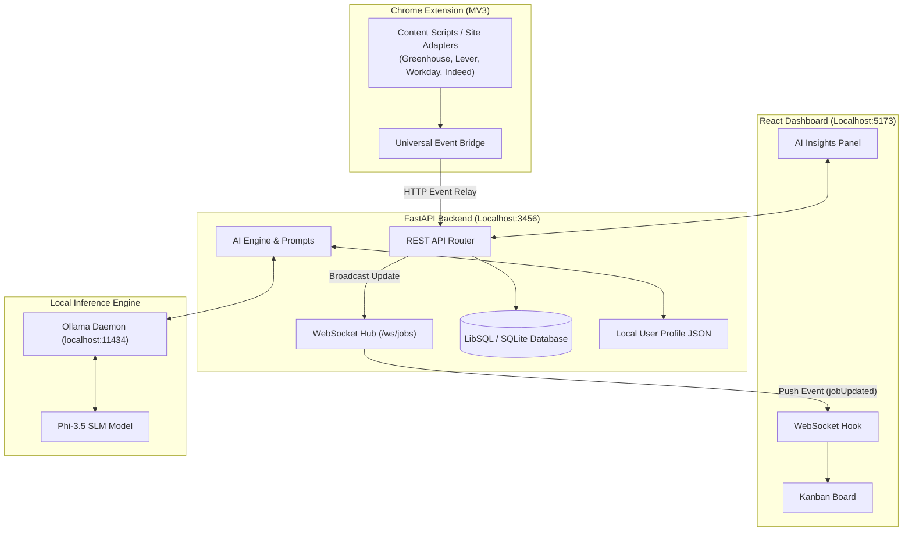

# ⚡ JobPulse

> **Automated Job Application Tracking & Evaluation Platform**  
> _Built with Python, FastAPI, WebSockets, SQLite, Ollama, TypeScript, and Chrome Extension (MV3)._

[](https://fastapi.tiangolo.com) [](https://www.python.org/) [](https://react.dev) [](https://www.typescriptlang.org/) [-black.svg?style=flat&logo=ollama&logoColor=white>)](https://ollama.com) [](LICENSE)

---

## 🌟 Overview

**JobPulse** is a client-server system designed to automate job application tracking and candidate evaluation without manual spreadsheet entry.

- **Browser Extension (MV3)**: Automatically detects when you submit a job application on platforms like LinkedIn, Greenhouse, and Lever, extracting job metadata (title, company, listing ID) and relaying it to the backend.
- **FastAPI Backend & WebSockets**: Provides REST APIs to store application records and maintains an active WebSocket hub to push real-time status updates to connected dashboard clients without page reloads.
- **Relational Storage (SQLite)**: Tracks applications across distinct lifecycle stages (`applied`, `interview`, `offer`, `rejected`) using an event-history table that preserves the full timeline of each transition.
- **Local AI Evaluation (Ollama / Phi-3.5)**: Evaluates job descriptions against candidate profiles locally on-device to calculate match scores and highlight required skills without sending data to external APIs.

---

## 🛠️ Core Capabilities

### 1. Browser Application Ingestion

- **Automated Capture**: Listens for application submissions across **Greenhouse, Lever, Workday, Indeed, Ashby**, and LinkedIn.
- **Confirmation & DOM Parsing**: Uses DOM observers and URL patterns to verify submission success screens and extract job metadata.
- **Service Worker Relay**: Relays payloads through a Manifest V3 background service worker, cleanly handling browser security and extension origins.

### 2. Real-Time State Synchronization

- **WebSocket Broadcast Hub**: Pushes instant state transitions down an open WebSocket channel directly to the dashboard.
- **Lifecycle Funnel**: Tracks jobs through structured stages: `New` ➔ `Seen` ➔ `To Apply` ➔ `Applied` ➔ `In Process` ➔ `Offered` (with terminal states: `Rejected`, `Withdrawn`, `Closed`, `Ghosted`).
- **Audit History**: Preserves past events in an immutable event-log table rather than overwriting historical data.

### 3. On-Device AI Candidate Fit (Phi-3.5)

- **Match Score Engine**: Compares your candidate profile with job descriptions to compute a 0–100 match score with matched vs. missing skill lists.
- **Apply Recommendation**: Evaluates descriptions to flag green flags, red flags, and provide an `Apply` | `Consider` | `Skip` recommendation.
- **Cover Letter Generation**: Generates targeted cover letters using Server-Sent Events (SSE) streaming.
- **Local & Private**: Runs completely on your machine via **Ollama**. Zero API keys, zero cloud costs, and zero external data sharing.

---

## 🏗️ Architecture



---

## 💻 Tech Stack & Engineering Highlights

| Component | Tech Stack | Highlights |
| --- | --- | --- |
| **Backend** | Python 3.14, FastAPI, SQLite / LibSQL, Pydantic v2, HTTPX | Async REST API, Pydantic schemas, raw SQL repository layer, robust lifecycle state transitions |
| **Real-Time** | WebSockets, FastAPI `ConnectionHub` | Asynchronous event broadcasting with auto-reconnecting exponential backoff client hook |
| **AI / LLM** | Ollama, Phi-3.5 SLM, Server-Sent Events (SSE) | Custom async LLM provider abstraction, structured JSON prompt engineering, SSE streaming endpoints |
| **Frontend** | React 18, TypeScript, Vite, TailwindCSS, TanStack Query | Responsive Kanban board, dark/light theme, custom drawer components, focus traps, optimistic updates |
| **Extension** | Chrome Extension Manifest V3, TypeScript, WebNavigation API | Content script adapters, DOM observers, background service worker event bridge |

---

## 🚀 Quickstart Guide

### Prerequisites

- **Node.js**: `v22+` & **pnpm**: `v9+`
- **Python**: `3.14+` with **uv**
- **Ollama**: [Download & Install Ollama](https://ollama.com)

### 1. Model Setup (Phi-3.5)

Pull the lightweight, high-performance Phi-3.5 model:

```bash
ollama pull phi3.5
```

### 2. Backend Setup & Run

```bash
# From repository root
cd apps/api

# Install dependencies (automatically handles venv)
uv sync

# Start the FastAPI server
uv run uvicorn app.main:app --port 3456 --reload
```

_API will run at `http://localhost:3456`._

### 3. Dashboard Setup & Run

```bash
# In a new terminal, from repository root
pnpm --filter web dev
```

_Dashboard will run at `http://localhost:5173`._

### 4. Build & Load Chrome Extension

```bash
# Build extension bundle
pnpm --filter job-tracker-extension build
```

1. Open Chrome and go to `chrome://extensions`
2. Enable **Developer mode** (top right)
3. Click **Load unpacked** and select the build directory: `/path/to/job-tracker-main/apps/extension/dist`

---

## 🧪 Verification & API Endpoints

| Endpoint | Method | Description |
| --- | --- | --- |
| `/api/ai/status` | `GET` | Health check for Ollama & Phi-3.5 availability |
| `/api/ai/profile` | `GET` / `PUT` | Manage candidate profile (skills, title, experience) |
| `/api/ai/jobs/{id}/fit-score` | `GET` | Compute match score & skill breakdown for a job |
| `/api/ai/jobs/{id}/signal` | `GET` | Calculate apply recommendation & green/red flags |
| `/api/ai/jobs/{id}/cover-letter` | `POST` | Stream custom cover letter via SSE |
| `/ws/jobs` | `WebSocket` | Real-time push updates for dashboard refetching |

---

## 📄 Privacy & Data Ownership

JobPulse is **100% self-hosted and single-user**.

- Application records remain in your local SQLite database (`apps/api/jobtracker.db`).
- All AI processing occurs locally via your local Ollama instance.
- No analytics, no external tracking, no cloud lock-in.

---

## 💡 Why This Project Stands Out for Recruiters

This repository demonstrates production-grade full-stack & AI engineering practices:

1. **Asynchronous Architecture**: High-throughput FastAPI endpoints, non-blocking HTTPX LLM requests, and WebSocket event broadcasting.
2. **Local AI Integration**: Production prompt engineering, raw streaming (SSE), JSON schema enforcement, and fallback handling for local SLMs.
3. **Cross-Boundary Systems**: Chrome Extension event bridging into a local daemon backend with real-time UI reactive state sync.
4. **Clean Code & Monorepo Structure**: Monorepo managed with `pnpm` & `uv`, TypeScript strict mode, and clear component architecture.

---

_Made with ❤️ by [Shreyan Anand](https://github.com/shreyanand)_
