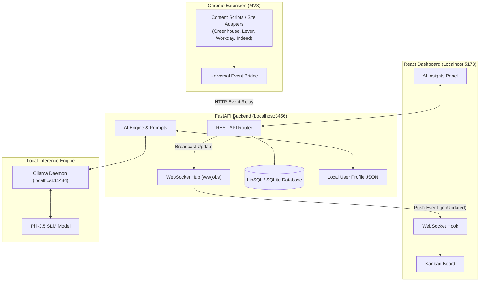

# ⚡ JobPulse AI

> **Silent Autonomous Job Tracking & Privacy-First Local AI Co-Pilot**  
> _Built with FastAPI, React, WebSockets, Chrome MV3 Extension & Local LLM (Phi-3.5 via Ollama)._

[](https://fastapi.tiangolo.com) [](https://react.dev) [](https://www.typescriptlang.org/) [-black.svg?style=flat&logo=ollama&logoColor=white>)](https://ollama.com) [](LICENSE)

---

## 🌟 Overview

**JobPulse AI** transforms how software engineers track and optimize their job applications. Instead of manually filling out spreadsheets or project boards, **JobPulse AI** runs silently in your browser, auto-detecting when you submit an application across major ATS platforms (Greenhouse, Lever, Workday, Indeed, Ashby, etc.) and updating your local real-time dashboard instantly via WebSockets.

It includes an **on-device AI Co-Pilot powered by Phi-3.5 (via Ollama)** that scores your candidate fit, flags risks, and streams custom cover letters in real-time — **100% free, local, and zero data leaving your machine.**

---

## 🔥 Key Superpowers

### 🤖 1. Silent Autonomous Application Watcher

- **Zero-Click Capture**: Sits silently while you apply on **Greenhouse, Lever, Workday, Indeed, Ashby**, or custom ATS portals.
- **Event Relay Bridge**: Detects application confirmation screens, extracts job metadata (title, company, listing ID), and dispatches lifecycle events.
- **Real-Time WebSocket Sync**: Broadcasts application updates directly to your local React Kanban board with zero latency.

### 🧠 2. Privacy-First Local AI Assistant (Phi-3.5)

- **⚡ Fit Score Engine**: Analyzes your local JSON profile against full job descriptions, calculating a 0–100 match score with matched vs. missing skill breakdowns.
- **🚦 Smart Apply Signal**: Evaluates job descriptions to highlight **Green Flags** vs. **Red Flags** and gives a clear `Apply` | `Consider` | `Skip` recommendation.
- **📝 Real-time Cover Letter Generator**: Generates candidate-tailored cover letters using Server-Sent Events (SSE) streaming.
- **🔒 100% On-Device & Free**: Runs locally on CPU/GPU via **Ollama & Phi-3.5**. Zero API keys, zero cloud costs, zero telemetry.

### 📊 3. Full-Lifecycle Kanban Dashboard

- **Lifecycle Funnel**: Move jobs seamlessly across `Bookmarked` ➔ `Applied` ➔ `Screening` ➔ `Interview` ➔ `Offer` ➔ `Archived`.
- **Live Connection Monitor**: Pulsing real-time WebSocket connection status indicator (`🟢 Watching`).
- **Duplicate & Repost Matcher**: Heuristic detection prevents duplicate tracking when the same job is re-posted under a different URL.

---

## 🏗️ Architecture



---

## 💻 Tech Stack & Engineering Highlights

| Component | Tech Stack | Highlights |
| --- | --- | --- |
| **Backend** | Python 3.14, FastAPI, PyTurso / LibSQL, Pydantic v2, HTTPX | Async REST API, Pydantic schemas, custom SQLite/Turso ORM layer, robust lifecycle state transitions |
| **Real-Time** | WebSockets, FastAPI `ConnectionHub` | Asynchronous event broadcasting with auto-reconnecting exponential backoff client hook |
| **AI / LLM** | Ollama, Phi-3.5 SLM, Server-Sent Events (SSE) | Custom async LLM provider abstraction, structured JSON prompt engineering, SSE streaming endpoints |
| **Frontend** | React 18, TypeScript, Vite, TailwindCSS, TanStack Query | Responsive Kanban board, dark/light theme, custom drawer components, focus traps, optimistic updates |
| **Extension** | Chrome Extension Manifest V3, TypeScript, WebNavigation API | Content script adapters, mutation observers, background service worker event bridge |

---

## 🚀 Quickstart Guide

### Prerequisites

- **Node.js**: `v22+` & **pnpm**: `v9+`
- **Python**: `3.14+` with **uv**
- **Ollama**: [Download & Install Ollama](https://ollama.com)

### 1. Model Setup (Phi-3.5)

Pull the lightweight, high-performance Phi-3.5 model:

```bash
ollama pull phi3.5
```

### 2. Backend Setup & Run

```bash
# From repository root
cd apps/api

# Install dependencies (automatically handles venv)
uv sync

# Start the FastAPI server
uv run uvicorn app.main:app --port 3456 --reload
```

_API will run at `http://localhost:3456`._

### 3. Dashboard Setup & Run

```bash
# In a new terminal, from repository root
pnpm --filter web dev
```

_Dashboard will run at `http://localhost:5173`._

### 4. Build & Load Chrome Extension

```bash
# Build extension bundle
pnpm --filter job-tracker-extension build
```

1. Open Chrome and go to `chrome://extensions`
2. Enable **Developer mode** (top right)
3. Click **Load unpacked** and select the build directory: `/path/to/job-tracker-main/apps/extension/dist`

---

## 🧪 Verification & API Endpoints

| Endpoint | Method | Description |
| --- | --- | --- |
| `/api/ai/status` | `GET` | Health check for Ollama & Phi-3.5 availability |
| `/api/ai/profile` | `GET` / `PUT` | Manage candidate profile (skills, title, experience) |
| `/api/ai/jobs/{id}/fit-score` | `GET` | Compute match score & skill breakdown for a job |
| `/api/ai/jobs/{id}/signal` | `GET` | Calculate apply recommendation & green/red flags |
| `/api/ai/jobs/{id}/cover-letter` | `POST` | Stream custom cover letter via SSE |
| `/ws/jobs` | `WebSocket` | Real-time push updates for dashboard refetching |

---

## 📄 Privacy & Data Ownership

JobPulse AI is **100% self-hosted and single-user**.

- Application records remain in your local SQLite database (`apps/api/jobtracker.db`).
- All AI processing occurs locally via your local Ollama instance.
- No analytics, no external tracking, no cloud lock-in.

---

## 💡 Why This Project Stands Out for Recruiters

This repository demonstrates production-grade full-stack & AI engineering practices:

1. **Asynchronous Architecture**: High-throughput FastAPI endpoints, non-blocking HTTPX LLM requests, and WebSocket event broadcasting.
2. **Local AI Integration**: Production prompt engineering, raw streaming (SSE), JSON schema enforcement, and fallback handling for local SLMs.
3. **Cross-Boundary Systems**: Chrome Extension event bridging into a local daemon backend with real-time UI reactive state sync.
4. **Clean Code & Monorepo Structure**: Monorepo managed with `pnpm` & `uv`, TypeScript strict mode, and clear component architecture.

---

_Made with ❤️ by [Shreyan Anand](https://github.com/shreyanand)_
